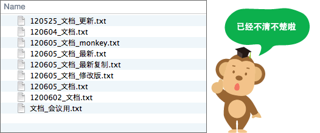

## 第一天
### 一、git基本操作
#### 1. 版本控制
什么是版本控制？版本控制是一种记录一个或若干文件内容变化，以便将来查阅特定版本修订情况的系统。

解决什么问题？

要把文档还原到编辑前的状态，大家都是怎么做的呢？
最简单的方法就是先备份编辑前的文档。使用这个方法时，我们通常都会在备份的文档名或目录名上添加编辑的日期。但是，每次编辑文档都要事先复制，这样非常麻烦，也很容易出错。


再加上，如果像上图那样毫无命名规则的话，就无法区分哪一个文档是最新的了。而且，如果是共享文件的话，应该加上编辑者的名字。还有，那些文档名字没有体现修改内容。

另外，如果两个人同时编辑某个共享文件，先进行编辑的人所做的修改内容会被覆盖，相信大家都有这样的经历


常见版本控制系统，git，svn，vcs

什么是git? 

Git是一个分布式版本管理系统，是Linus Torvalds为了更好地管理Linux内核开发而创立的。

Git可以在任何时间点，把文档的状态作为更新记录保存起来。因此可以把编辑过的文档复原到以前的状态，也可以显示编辑前后的内容差异。

而且，编辑旧文件后，试图覆盖较新的文件的时候（即上传文件到服务器时），系统会发出警告，因此可以避免在无意中覆盖了他人的编辑内容


基本概念
1. 本地仓库，自己机器上的仓库

* Index
Index（索引，或暂存区）是工作区和版本区的中间cache,缓存区存储在 .git 文件夹中

* 工作区
工作区就是当前项目目录 在你将修改提交到暂存区并记录到历史之前，可以随意更改。

* 版本区
版本区，提交(git commit)后,数据进入版本区，纳入版本管理，每个commit都是一个版本，版本区在.git文件夹中

2. 远程仓库
配有专用的服务器，为了多人共享而建立的仓库


3. 文件状态
git中的文件有以下几种状态：

* 未跟踪（untrack）：表示文件为新增加的。

* 已修改（modified）：表示修改了文件，但还没保存到git仓库中。

* 已暂存（staged）：表示对一个已修改文件的当前版本做了标记，使之包含在下次提交的快照中。 

* 已提交（committed）：表示文件已保存在git仓库中。

#### 2. 安装git
1. windows
打开`https://git-scm.com/download/win`下载，完成后，双击安装
2. mac
先安装homebrew，homebrew是一个包管理管理工具，可以使用命令安装软件,打开mac终端执行以下命令
`/bin/bash -c "$(curl -fsSL https://raw.githubusercontent.com/Homebrew/install/master/install.sh)"`
安装git
`brew install git`
3. linux
* centos发行版 `yum install git`
* ubuntu发行版 `apt install git`
yum和apt 分别为centos和ubuntu的包管理工具

windows下的git会安装一个git-bash，用于从命令行运行Git。 git-bash中使用git，就像在LINUX和UNIX(mac 是一种unix)环境中使用git一样

git-bash 使用minGW实现的windows版的bash并包含git命令
minGW是将GCC编译器(一种c语言编译器)和GNU Binutils(一整套开源的linux工具)移植到Windows平台下的产物，包括一系列头文件、库和可执行文件。


#### 3.初次运行git前的配置

配置name和email，这个会出现在commit里

```
git config --global user.name "John Doe"
git config --global user.email johndoe@example.com
```
检查配置信息
```
git config  --list
```
这个配置信息会存放在
`~/.gitconfig` 文件
查看文件内容
```
 cat ~/.gitconfig
[user]
        email = jiaminqiangx@163.com
        name = jiaminqiangtest
[core]
        autocrlf = input
        safecrlf = true

```

#### 4. 创建git项目
两种方式，本地创建和从远程克隆

* git init
* git clone

**对已有项目，开始使用git，打开git bash进入项目目录**

初始化项目目录
````
git init
````
初始化后，在当前目录下会出现一个名为 .git 的隐藏目录目录(`ls -a`查看)，所有 Git 需要的数据和资源都存放在这个目录中。
如果当前目录下有几个文件想要纳入版本控制，需要先用 git add 命令告诉 Git 开始对这些文件进行跟踪，然后提交
如果要排除一些目录或文件既不加入版本控制，需要创建一个.gitignore的文件，文件写上要排除的目录活文件


将文件加入git 本地仓库
````
git add hw.py
git commit -m 'init this project'
````
* git add 对文件进行跟踪，添加到暂存区
* git commit 提交到本地仓库
**从已有远程git仓库克隆**

````
git clone https://github.com/jiam/python-dev.git

````
#  git submodule 查看当前目录是否存在远程地址   git rm --cached  删除远程地址命令  之前需要将文件中 .git文件删掉
当前目录就会出现python-dev这个项目 `https://github.com/jiam/python-dev.git` 为远程仓库的地址

注：远程仓库有两种地址一种是https的，一种git的，比如上面的git地址为`git@github.com:jiam/python-dev.git`

#### 5. 将本地的git项目push到远程仓库如：github
* 在github注册账号
* 登陆github
* 创建一个github项目与本地项目同名
````
echo "# test" >> README.md
git init
git add README.md
git commit -m "first commit"
git remote add origin https://github.com/jiam/test.git
git push -u origin master
````
* `echo "# test" >> README.md`  创建一个文件名字为README.md，内容为`# test`
* `git init` 创建一个本地仓库
* `git add README.md` 将README.md提交到暂存区，README.md项目介绍文件
* `git commit -m "first commit"` 将暂存区的变更提交到本地仓库
* `git remote add  origin` 为本地仓库添加一个管理的远程仓库，  https://github.com/jiam/test.git为远程仓库的url,origin就是这个远程仓库的别名
* `git push -u` 将本地仓库的master 分支推送的远程名字为 origin 仓库master分支，第一次推送的时候执行，以后直接使用`git push`
-u 为--set-upstream 的缩写既将本地master 分支与 远程origin仓库的master分支关联，origin是本地仓库的上游
 

#### 6. git的回滚
* 工作区 
* 暂存区
* 已提交区

工作区即当前目录，使用git add 命令后，文件被追踪，状态为在暂存；git commit后提交到仓库
**只修改文件未执行git add**
```
git checkout filename
```
**修改文件后，执行git add 但未执行git commit**
```
git reset HEAD # 恢复暂存区
git checkout filename #恢复工作区
```
或者
```
git restore --staged filename #恢复暂存区
git restore filename # 恢复工作区

```

**修改文件后，执行了git add和git commit**
将本地仓库的，已提交区、暂存区、工作区全部还原
````
git reset --hard HEAD^1  
````
HEAD 为一个指针默认指向当前分支的最新commit,HEAD^1即当前commit的上一个commit,当然页可以直接指定上一个commit的commitid 
`git reset --hard 3d5e56c5e16c5434dd574b6e6af0f4ed03576c4c`


## 分支
在开发软件时，可能有多人同时为同一个软件开发功能或修复BUG，可能存在多个Release版本，并且需要对各个版本进行维护，这是就得引入分支。

分支是为了将修改记录的整体流程分叉保存。分叉后的分支不受其他分支的影响，所以在同一个仓库里可以同时进行多个分支


这里a-b-c是一个分支，a-b-o，a-b-x也是分支，a,b,o,x为commit
仓库初始化是会创建一个名字为master的本地分支
### 分支基本操作

在仓库中添加一个新的分支dev
````
git branch dev
````
切换分支
```
git checkout dev
```
创建并切换分支
```
git branch -b dev
```
将新的分支push到远程仓库
```
git push --set-upstream origin dev
# 或
git push -u origin dev
```

拉取远程分支
```
git checkout dev
```
本地不存在dev时，远程存在时拉取远程dev，并创建本地dev分支
如本地存在，既切换到本地的dev分支

查看本地分支

`git branch`

查看远程分支

`git branch -r`

查看所有分支
`git branch --all`

查看本地分支与远程分支的关联关系

`git branch -vv`

删除分支

`git branch -d 分支名`

#### 7. 合并分支
在dev中更改代码后想合并回master
````
git checkout master
git merge dev
````
注意这里有可能会产生文件冲突，冲突后需要手动合并冲突


### 认证配置
git两种常见认证
1. 使用账户密码-用于http协议
2. 使用ssh密钥-用于git协议
#### 配置git密码
1. 配置全局密码 
```
git config --global user.name 'jiam'
git config --global user.password 'xxxx'
```
2. 配置记录手动输入的密码
```
git config --gloabal credential.helper store
```

注：第一种方法为明文保存的密码

#### 配置密钥
```
ssh-keygen
# 然后连续回车在~/.ssh下会生成两个文件id_rsa,id_rsa.pub
cat  ~/.ssh/id_rsa.pub

# 复制内容添加到github中的ssh认证中，使用git协议地址不需要密码
```
推荐使用密钥配置

## 二、 pycharm中使用git
#### 1. 新建git项目
打开pycharm->vcs->checkout from versin control->git 

填写git的url，和本地的项目目录

#### 2. git add
右键->git->add

#### 3. git commit
右键->git->commit

#### 4. 未提交回滚
右键->git->revert

#### 5. 已提交回滚
右键->git->Repository->Rest HEAD
#### 6. 增加分支
右键->git->Repository->Branches->New Branch 填入分支名称

#### 7. 切换分支
右键->git->Repository->Branches->分支名->checkout

#### 8. 合并分支
右键->git->Repository->Merge Changes->选择要合并的分支

#### 9. 推送到远程
右键->git->Repository->push

## 三、 回顾python基础
编写一个通讯录程序，实现增删改查功能
#### 1.设计数据结构
一条记录： 姓名，电话， id

一个通讯录：列表，里面元素为记录

#### 2. 函数设计
* 增加 add_record
* 查询 query_record
* 修改 change_record
* 删除 delete_record

#### 3. 菜单设计
* main函数
* while 循环
* 选择相应功能
示例
````

        通讯录
        1. 添加
        2. 查找
        3. 删除
        4. 修改
        5. 退出
        
请选择操作:1
请输入姓名:jia
请输入电话:123
添加成功

        通讯录
        1. 添加
        2. 查找
        3. 删除
        4. 修改
        5. 退出
        
请选择操作:
````


## 四、使用面向对象实现该通讯录
#### 1.设计数据结构
* 记录类 Record
* 通讯录类 PhoneBook

#### 2. 类方法设计
* Record __init__、 set_number
* PhoneBook __init__、add_record、query_record、change_record、delete_record
#### 3. 菜单设计不变

## 五、 python对象序列化pickle
pickle模块是一种的对象序列化工具；对于内存中几乎任何的python对象，都能把对象转化为字节串，
这个字节串可以随后用来在内存中重建最初的对象。pickle模块能够处理我们用的任何对象，列表，字典
嵌套组合以及类和实例

#### 1. dumps和 loads
列表对象
````
>>> import pickle
>>> l = [1,2,3]
>>> pickle.dumps(l)
b'\x80\x03]q\x00(K\x01K\x02K\x03e.'
>>> b = pickle.dumps(l)
>>> b
b'\x80\x03]q\x00(K\x01K\x02K\x03e.'
>>> pickle.loads(b)
````

字典对象
````
>>> d = {"id":1, "name": "贾敏强", "phone_number":"15801396646"}
>>> pickle.dumps(d)
b'\x80\x03}q\x00(X\x02\x00\x00\x00idq\x01K\x01X\x04\x00\x00\x00nameq\x02X\t\x00\x00\x00\xe8\xb4\xbe\xe6\x95\x8f\xe5\xbc\xbaq\x03X\x0c\x00\x00\x00phone_numberq\x04X\x0b\x00\x00\x0015801396646q\x05u.'
>>> b = pickle.dumps(d)
>>> pickle.loads(b)
{'id': 1, 'name': '贾敏强', 'phone_number': '15801396646'}
````

类和实例
````
import pickle


class Record:
    def __init__(self, name, phone_number):
        self.name = name
        self.phone_number = phone_number


R = pickle.dumps(Record)
print(R)
print(pickle.loads(R))

record = Record("贾敏强", "15801396646")
r = pickle.dumps(record)
print(r)
print(pickle.loads(r))
````

#### 2. dump 和load
````
import pickle

L = [1, 2, 3]
#  序列化
with open("/Users/wangqiujin/Desktop/pycharm/gittest/L.dat", "wb") as f:
    pickle.dump(L,f)
with open("/Users/wangqiujin/Desktop/pycharm/gittest/L.dat", "rb") as f:
    print(f.read())
#  反序列化
with open("/Users/wangqiujin/Desktop/pycharm/gittest/L.dat", "rb") as f:


class Record:
    def __init__(self, name, phone_number):
        self.name = name
        self.phone_number = phone_number


with open("/Users/wangqiujin/Desktop/pycharm/gittest/Record.dat", "wb") as f:
    pickle.dump(Record, f)
with open("/Users/wangqiujin/Desktop/pycharm/gittest/Record.dat", "rb") as f:
    print(pickle.load(f))

record = Record("贾敏强", "15801396646")
with open("/Users/wangqiujin/Desktop/pycharm/gittest/record.dat", "wb") as f:
    pickle.dump(record, f)
with open("/Users/wangqiujin/Desktop/pycharm/gittest/record.dat", "rb") as f:
    print(pickle.load(f))


records = []
records.append(record)
with open("/Users/wangqiujin/Desktop/pycharm/gittest/records.dat", "wb") as f:
    pickle.dump(records, f)

with open("/Users/wangqiujin/Desktop/pycharm/gittest/records.dat", "rb") as f:
    print(pickle.load(f))

````

## 六、 练习
#### 1. 使用json将通讯录（函数）序列化
#### 2. 使用pickle将通讯录（面向对象）序列化


